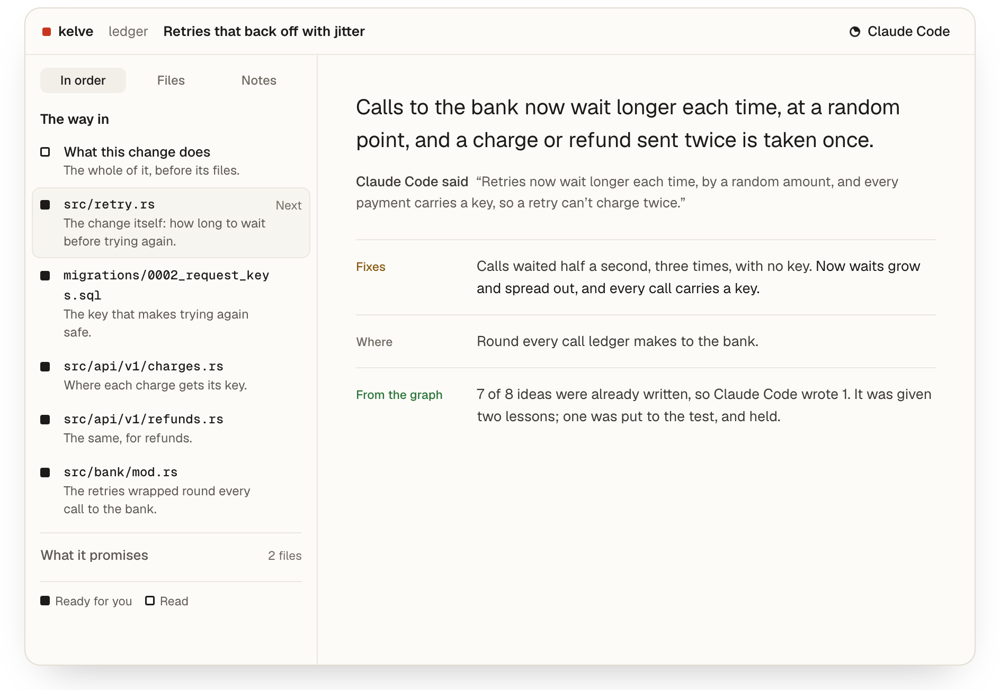
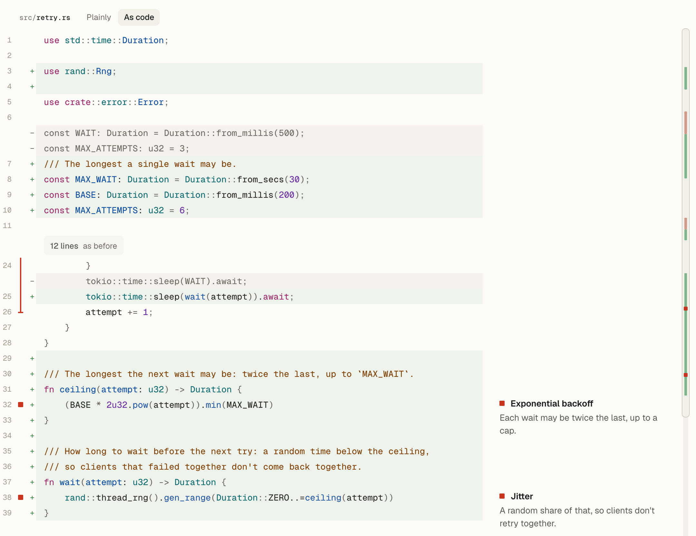
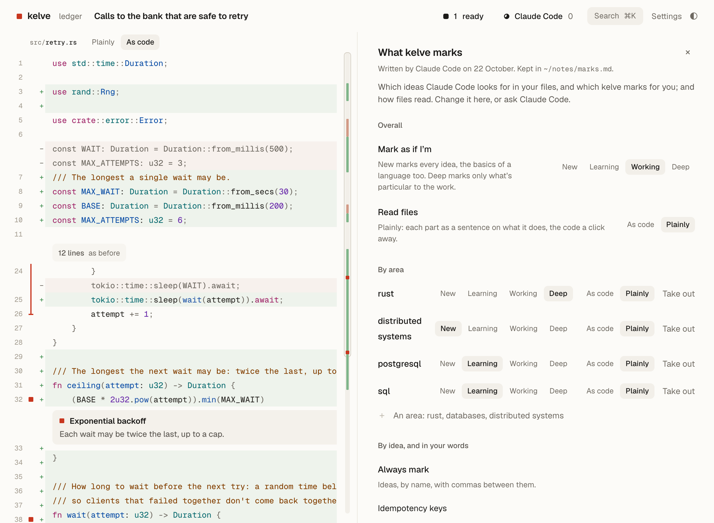
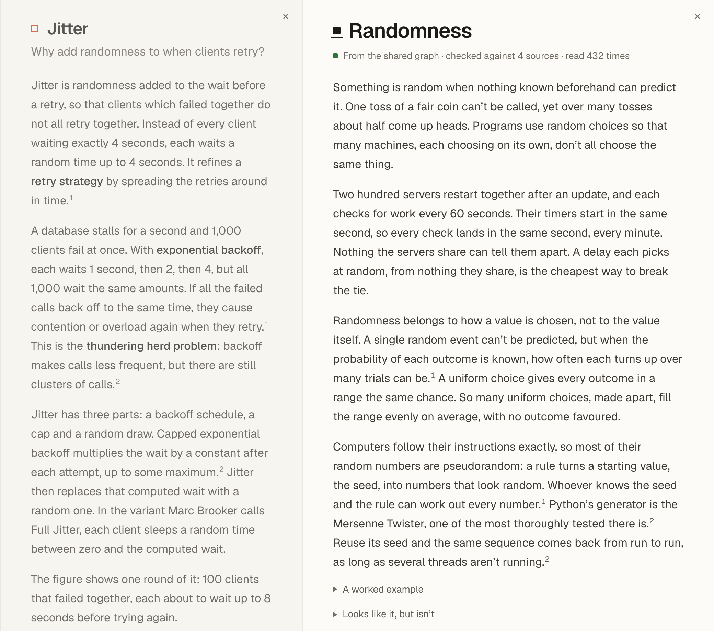
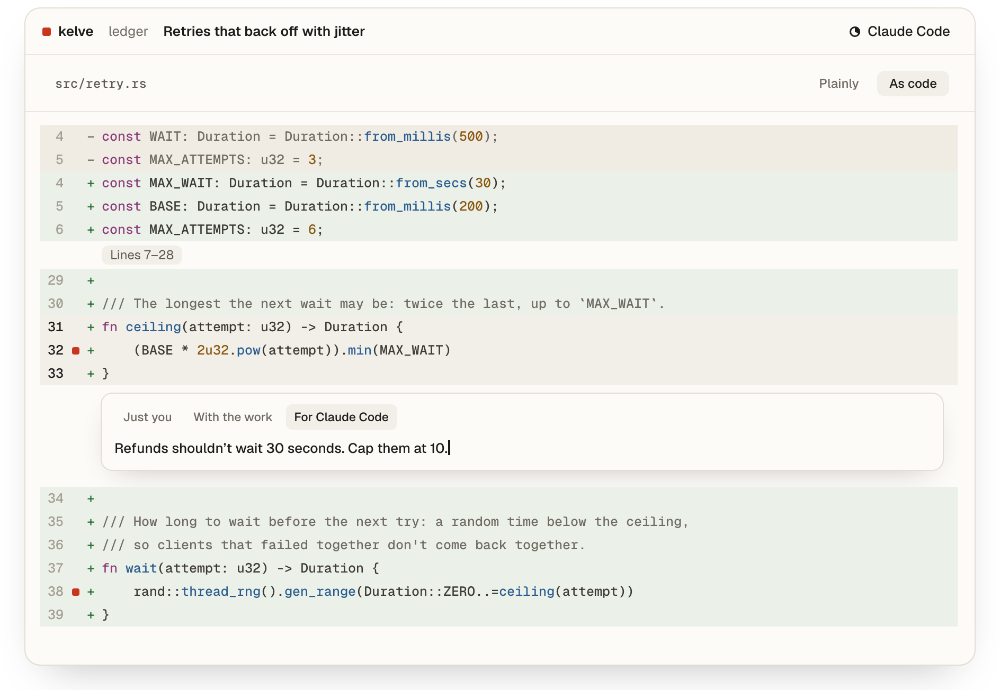
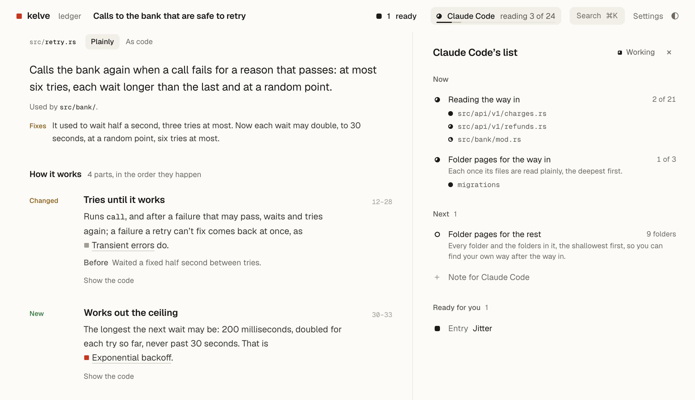

<h1 align="center">
  <picture>
    <source media="(prefers-color-scheme: dark)" srcset="brand/logo/lockup-dark.svg">
    
  </picture>
</h1>

<h3 align="center">Understand what your agent did.</h3>

<p align="center">kelve walks you through your agent’s work in plain words.<br>It runs on your computer, with the agent you already use.</p>

<p align="center">
  <a href="https://kelve.ai/demo/#/example"><b>Try the example</b></a> ·
  <a href="https://kelve.ai">kelve.ai</a> ·
  <a href="https://kelve.ai/docs/">Docs</a>
</p>

Ask your agent:

```
Install kelve from kelve.ai/install.sh
```

Works with Claude Code, Codex, Cursor and other agents.

---

**1,194 lines. You didn’t write them. You’re about to merge them.**

The diff shows you every line. It doesn’t show you what they do, or why. Here’s one change, the way kelve shows it.

## It starts with what changed.

One sentence for the whole change, before any files. Then what it did before, and what it does now.

<picture>
  <source media="(prefers-color-scheme: dark)" srcset=".github/assets/change-dark.png">
  
</picture>

## Then the way in.

The files in the order that makes sense, each building on the last. Start at once. Stop when you know enough.

<picture>
  <source media="(prefers-color-scheme: dark)" srcset=".github/assets/way-in-dark.png">
  
</picture>

## Each file in plain words. Or the code. Or both.

What it’s for, then each part, in the order things happen. Switch to the code, or open the lines under any part. kelve checks every sentence against the lines it explains.

<picture>
  <source media="(prefers-color-scheme: dark)" srcset=".github/assets/plainly-dark.png">
  
</picture>

<picture>
  <source media="(prefers-color-scheme: dark)" srcset=".github/assets/code-dark.png">
  
</picture>

## The ideas behind it, marked for you.

Each idea the work rests on gets a square, beside the lines that use it. Set how much to mark overall, then add the areas you know better, or less well.

<picture>
  <source media="(prefers-color-scheme: dark)" srcset=".github/assets/marks-dark.png">
  
</picture>

## Go as deep as you like.

Click an idea and it opens beside the work. Click what it rests on, and that opens beside it. Keep going, down to first principles.

<picture>
  <source media="(prefers-color-scheme: dark)" srcset=".github/assets/deeper-dark.png">
  
</picture>

## Leave a note, for you or your agent.

Select lines and write. Keep it just for you, or with the work, for anyone who opens it. Or leave it for your agent: it does it the next time you message it, then shows you what it changed.

<picture>
  <source media="(prefers-color-scheme: dark)" srcset=".github/assets/note-dark.png">
  
</picture>

## Its list is your queue.

Everything you’ve asked of your agent, in order. Add to it while it works. Move what matters up.

<picture>
  <source media="(prefers-color-scheme: dark)" srcset=".github/assets/list-dark.png">
  
</picture>

## See what it learned.

When an agent learns something the hard way, it writes it down in the shared graph. Your agent is given those lessons as it works. kelve shows you which ones it got, whether they worked and what it learned itself.

<picture>
  <source media="(prefers-color-scheme: dark)" srcset=".github/assets/lesson-dark.png">
  
</picture>

## Not only changes.

Open a repo you’ve inherited, a folder, or your thesis. Ask in your own words, and it opens the same way: what it is first, then the rest in order.

```
Show me this repo in kelve.
```

## Most ideas are already written.

Explanations come from one shared graph of how things work, at `graph.kelve.ai`, written by everyone’s agents and checked against their sources. So most open at once. It also holds the lessons other agents learned along the way too which are given to yours as it works.

- **Never your work.** Your code, files and notes stay with you.
- **What your agent writes and learns is added,** without your name. Your reads never say who you are.
- **Public domain, under [CC0](https://creativecommons.org/publicdomain/zero/1.0/).** Anyone may use what’s in it, for anything.

It’s free with a GitHub or Google sign-in. Rather not? kelve works without it: don’t sign in, or set `KELVE_GRAPH_URL=off`. [What goes where](https://kelve.ai/docs/what-goes/).

## Yours, on your computer.

- **Runs beside your agent.** What you open goes to no one but it.
- **No model of its own.** Your agent does the reading, on the plan you already have.
- **Nothing to sign up for.** It works signed out.
- **Open source.** Apache 2.0. Read every line of it.

## Start

Ask your agent:

```
Install kelve from kelve.ai/install.sh
```

Then your agent shows you its work when it’s done. Or ask it:

```
Show me what you did in kelve.
```

<details>
<summary>Install it yourself</summary>

<br>

Run the installer in a terminal. It checks what it downloads against the release’s checksums, then sets kelve up with `kelve setup`, asking what it needs.

macOS and Linux, into `~/.local/bin`:

```sh
curl -fsSL https://kelve.ai/install.sh | sh
```

Windows, into `%LOCALAPPDATA%\kelve\bin`, added to your PATH:

```powershell
irm https://kelve.ai/install.ps1 | iex
```

From source, with Rust and Bun:

```sh
git clone https://github.com/kelve-ai/kelve
cd kelve/web && bun install && bun run build && cd ..
cargo install --path crates/cli --locked
kelve setup
```

Then start a new session with your agent, so it has kelve’s tools.

</details>

## Docs

- **[kelve’s docs](https://kelve.ai/docs/)**, on kelve.ai: installing kelve, using it with your agent, and what it does with your work. To start: [install](https://kelve.ai/docs/install/), [connect your agent](https://kelve.ai/docs/connect/) and [what goes where](https://kelve.ai/docs/what-goes/).
- [How kelve is built](docs/architecture.md), [developing it](docs/developing.md), [its settings](docs/self-hosting.md) and [releasing it](docs/releasing.md).
- [Contributing](CONTRIBUTING.md), [working on kelve with agents](AGENTS.md) and [reporting a security problem](SECURITY.md).

## License

Apache 2.0 ([what it allows](docs/license.md)). The kelve name and logo aren’t covered by it: [using them](brand/README.md). Questions: hello@kelve.ai.
